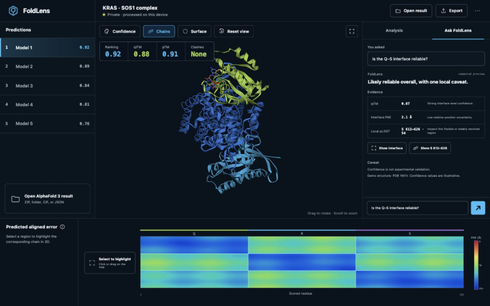

# FoldLens

FoldLens is a local-first review workspace that turns an AlphaFold 3 result folder into one evidence-linked view of structures, confidence metrics, PAE, predicted regions, and a grounded GPT-5.6 analysis.



Built for the **Work & Productivity** track of OpenAI Build Week 2026.

## The problem

Reviewing an AlphaFold 3 job often means moving between a download folder, a molecular viewer, summary JSON, and a separate PAE plot. That context switching makes it easy to lose track of which confidence value belongs to which model, chain pair, or residue range.

FoldLens keeps that review loop in one workspace. It does not claim that confidence is experimental validation, and it does not perform docking, screening, or structure prediction.

## What works

- Open an AlphaFold 3 ZIP, output folder, `.cif`/`.mmcif`, or matching confidence JSON files.
- Match structures to summary confidence and full PAE data automatically.
- Rotate and zoom the 3D structure, switch samples, and compare ranking score, ipTM, pTM, and clash status.
- Toggle chains, confidence/chain coloring, molecular surface, and focused interface, pocket, or predicted-region views.
- Inspect detected ligands and ions in a dedicated list, toggle equivalent copies together, and see CCD labels anchored in 3D.
- Select the PAE heatmap and highlight the corresponding chain or residue range in 3D.
- Ask FoldLens a question and receive a short GPT-5.6 interpretation grounded only in deterministic facts extracted from the loaded result.
- Act on cited evidence with controls such as **Show interface** and **Show residues**.
- Export a JSON session or a self-contained HTML review report.
- Use responsive Structure, PAE, Models, and Insights views on mobile.
- Keep structure parsing in the browser; FoldLens does not upload the source CIF, JSON files, atomic coordinates, or sequences to its server.

The bundled sample is clearly labelled. All five sample entries reuse the same experimental PDB 1NVV coordinates; only their illustrative confidence variants differ. They are not AlphaFold outputs and their overlay is not a structural comparison.

## How GPT-5.6 is used

The browser derives a small `AnalysisFacts` object containing only the currently visible metrics, chain IDs, residue ranges, PAE summaries, and notices. The server sends those facts and the user's question to the OpenAI Responses API using Zod Structured Outputs.

The model is instructed to:

- use only supplied facts;
- distinguish prediction confidence from experimental evidence;
- avoid clinical, therapeutic, docking, and mechanistic claims;
- return evidence actions that reference only supplied chains and residue ranges.

The validated response drives both the explanation and evidence-linked viewer actions. If the API key is absent, quota is unavailable, the request fails, or output validation fails, FoldLens returns the same response shape from a deterministic local analyzer and visibly labels the answer as offline.

The OpenAI API key is server-only. The public endpoint has a configurable per-IP rate limit, and the request schema limits text and array sizes.

## How Codex contributed

Codex was used as an iterative engineering and product-design partner throughout OpenAI Build Week:

- translated the initial one-screen research workflow into typed React components and an Express boundary;
- implemented and tested AlphaFold 3 ZIP/folder parsing, sample matching, PAE selection, export, and responsive modes;
- converted usability findings into the first-run import flow, explicit sample-data labels, evidence-linked actions, and mobile navigation;
- helped generate and compare design concepts, then record intentional deviations in fidelity ledgers;
- expanded regression coverage while investigating parser edge cases, confidence semantics, and viewer interactions.

The key human decisions were to keep raw scientific files local, send only the user's question plus derived facts to GPT-5.6, bound viewer actions to the active model, show evidence and caveats with each answer, label the sample truthfully, and prefer explicit scientific limitations over a more impressive but misleading demo.

## Architecture

```text
src/lib/af3Parser.ts          local ZIP/folder/CIF/JSON parsing and matching
src/lib/analysis.ts           deterministic facts and offline analysis
src/lib/analysisSchema.ts     strict GPT request/response contract
src/components/               molecular viewer, PAE, models, inspector, assistant
server/predictionAnalysis.ts  server-only OpenAI Responses API integration
server/rateLimit.ts           public demo request limiter
server/index.ts               Express API and Vite/production app server
```

Raw result files remain in the browser. Only the user's question and the compact, schema-limited analysis facts shown in the UI are sent to `/api/analyze`.

## Run locally

Requirements: Node.js `20.19+` or `22.12+`, and npm.

```bash
npm ci
cp .env.example .env.local
npm run dev
```

Open <http://127.0.0.1:4178>. Select **Explore sample result** for a no-setup walkthrough, or open your own AlphaFold 3 ZIP/folder.

### Configuration

| Variable | Purpose | Default |
| --- | --- | --- |
| `OPENAI_API_KEY` | Enables live grounded GPT-5.6 analysis | unset → local analyzer |
| `OPENAI_MODEL` | Responses API model | `gpt-5.6-sol` |
| `MOCK_ANALYSIS` | Forces local analysis when `true` | `false` |
| `ANALYSIS_RATE_LIMIT_MAX` | Requests allowed per IP and window | `20` |
| `ANALYSIS_RATE_LIMIT_WINDOW_MS` | Rate-limit window in milliseconds | `3600000` |
| `RENDER_API_URL` | Render service origin used only by the Vercel API proxy | unset |
| `PORT` | Express port | `4178` |

## Verify

```bash
npm run verify
```

This runs the Vitest suite, TypeScript checks, and the Vite production build. Tests cover AlphaFold file matching, PAE parsing and selection, predicted regions, evidence actions, exports, viewer controls, responsive entry flows, and API rate limiting.

For a production-style local run:

```bash
npm run build
npm run start
```

## Deploy on Render

The included `render.yaml` defines a Node web service with the correct build, start, and health-check commands.

1. Push this directory as its own GitHub repository.
2. In Render, create a Blueprint from that repository.
3. Set the requested `OPENAI_API_KEY` secret.
4. After deploy, confirm `/api/health` reports `analysisMode: "live"` and test one assistant question.
5. Set a small OpenAI project budget and usage alert in addition to the application rate limit.

## Deploy on Vercel

Vercel serves the Vite frontend and two same-origin serverless endpoints. Those endpoints proxy `/api/health` and `/api/analyze` to Render, so `OPENAI_API_KEY` remains on Render and is never copied into the browser or Vercel project.

1. Import the same GitHub repository into Vercel.
2. Keep the detected Vite build settings from `vercel.json`.
3. Add `RENDER_API_URL` with the public Render origin, without an API path.
4. Deploy and confirm `/api/health` returns the Render service response.

Pushes to the repository deploy both services through their Git integrations. Render remains the canonical backend and full-app deployment; Vercel is the fast review URL for the static frontend.

## Current limitations

- `.zst` compressed AlphaFold 3 outputs must be decompressed before opening.
- The primary PAE interaction links a selected matrix region to its corresponding chain or residue range; it is not an atomic-contact calculation.
- Predicted regions inferred from PAE are labelled as predicted regions, not named functional domains.
- FoldLens interprets confidence outputs; it does not establish biological truth or experimental validation.
- The in-memory public-demo rate limit resets when the server restarts and is not a substitute for an OpenAI project spending limit.

## Data, terms, and attribution

- User-provided AlphaFold Server output remains subject to the [AlphaFold Server Output Terms](https://alphafoldserver.com/output-terms), including its non-commercial and attribution requirements.
- The bundled experimental structure is [RCSB PDB 1NVV](https://www.rcsb.org/structure/1NVV), DOI [`10.2210/pdb1NVV/pdb`](https://doi.org/10.2210/pdb1NVV/pdb).
- Molecular rendering uses [3Dmol.js](https://3dmol.org/) under the BSD-3-Clause license.
- Full notices are in [THIRD_PARTY_NOTICES.md](THIRD_PARTY_NOTICES.md).

The bundled sample's confidence values are illustrative and labelled as such throughout the interface. Its five confidence variants deliberately reuse one experimental coordinate set and must not be presented as five independently predicted structures.
