# FoldLens Hackathon UI/UX Audit

実施日: 2026-07-22  
対象: 現在のローカル実装、バンドルされたサンプル結果  
確認幅: 1280×720、900×720、390×844

## 結論

FoldLensは「AIが説明する」だけで終わらず、説明の根拠をPAEと3D構造へ戻せる点が強い。これはハッカソンで十分に差別化できる。一方、現状は**決勝級だが、まだ優勝級ではない**。主因は、900px前後で画面が物理的に切れること、モバイルのモデル比較結果が操作直後に見えないこと、サンプル開始時点でAI回答が既に存在してGPTの価値が“作り物”に見えやすいことの3点。

優勝に最も近いデモ導線は次の一本に絞るべき。

1. サンプルを開く
2. `Is the Q–S interface reliable?` をGPT-5.6に問い合わせる
3. `ipTMは強いがreciprocal median PAEは広い不確実性`という結論を見る
4. `Show interface` と `Show S 612–626` で3DとPAEへ戻る
5. Variant 2と比較し、結論がどう変わるかを示す

## 優先順位

| 優先度 | 問題 | 影響 | 推奨対応 |
|---|---|---|---|
| P0 | 821–959pxでデスクトップ3列の最小幅がviewportを超える | 900pxでは右パネルが60px切れ、回答・タブ・操作が欠落する | モバイル切替を960px前後へ上げるか、中間幅専用の2列構成にする |
| P0 | モバイルのモデル比較結果が操作直後に見えない | scrollY=195の状態で比較サマリーがviewport上端より上に挿入され、選択色以外の結果が見えない | 比較サマリーをModelsタブ内に置く。少なくとも比較開始時にサマリーを可視領域へ出す |
| P0 | サンプルを開いた瞬間に`You asked`と`offline confidence brief`が表示される | AIを実行していないのに回答済みに見え、GPT-5.6利用が静的モックに見える | 初期状態を`Instant metric baseline`に分離し、明示的な`Run GPT-5.6 analysis`を主CTAにする |
| P1 | デスクトップの同時表示量が多く、7–10pxの補助文字が多い | 1280×720で科学的情報は多いが、審査員が見る順序をつかみにくい | 現在タスクに応じてPAE/Models/Insightsを段階表示し、主要本文を最低12pxへ上げる |
| P1 | モバイルで常に52dvhの3Dビューが先に残る | PAE、Models、Insightsへ移ってもコンテンツが下に追いやられ、状態変化が上で起きる | 非Structureタブでは3Dを160–220pxのサマリーへ縮め、展開ボタンを置く |
| P1 | AIの`Show S 612–626`後、PAEは同一チェーン選択なのにchain-pair selectは`Choose pair…`へ戻る | 画面上の選択状態と入力値が一致しない | `Custom selection: S 612–626 ↔ S 612–626`を表示するか、chain-pairとresidue selectionを別コントロールにする |
| P1 | 中間幅で`Reset view`がアイコンのみになり、アクセシブル名も消える | 900pxのDOMでは無名buttonになった | buttonに常時`aria-label="Reset view"`を付与する |
| P1 | サンプルCTAが入口で最も弱い見た目 | 審査員が自前のAF3ファイルを持っていない場合、最短デモ導線が見つけにくい | `Start 90-second sample`を明るいsecondary CTAへ格上げする |
| P2 | 比較・PAE・AIの状態がタブをまたいで残り、3D上のオーバーレイが積み重なる | 強い機能が“情報ノイズ”へ変わる | 現在状態を1行で要約するstate barと、`Clear all focus`を追加する |
| P2 | `STEP 1`だけが見え、後続ステップが存在しない | 不要な未完感が出る | 削除するか、Open → Inspect → Explainの3段階として見せる |

## フロー別評価

### 1. デスクトップ入口 — 良好

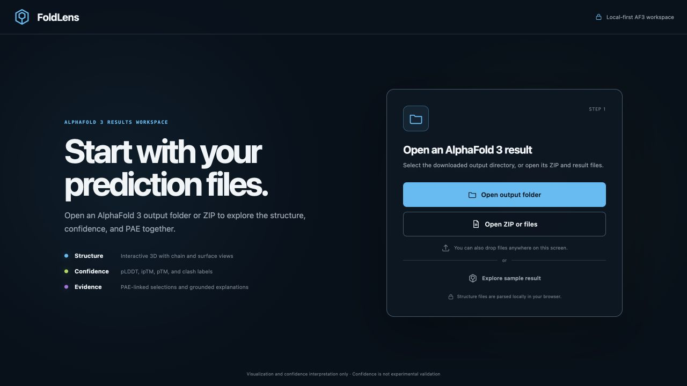

- 強み: 価値、ファイル種別、ローカル処理、免責が1画面に収まる。視線は左の価値説明から右のimportへ自然に流れる。
- リスク: `Explore sample result`が最も淡く、ハッカソン審査用の最短導線として弱い。
- 改善: primaryは実ファイルのままでよいが、sampleを明確なsecondaryにし、所要時間と見どころを添える。

### 2. デスクトップ結果全景 — 要整理

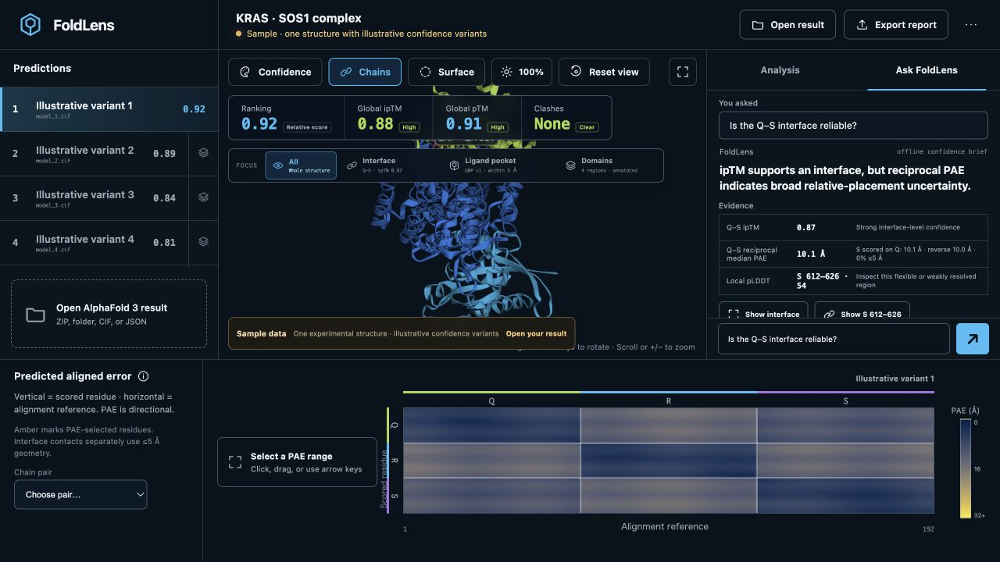

- 強み: 構造、ランキング、AI、PAEが同時に存在し、「別ツールを行き来しない」という製品価値が一目で分かる。
- リスク: 1280×720でも5つの主要領域が競合する。初見では「モデルを選ぶ」「Focusを選ぶ」「AIを見る」「PAEを見る」の優先順位がない。
- 改善: sample開始時だけ3ステップのguided modeを表示し、完了後に現在のpower-user layoutへ開く。

### 3. Interface focus — 良好

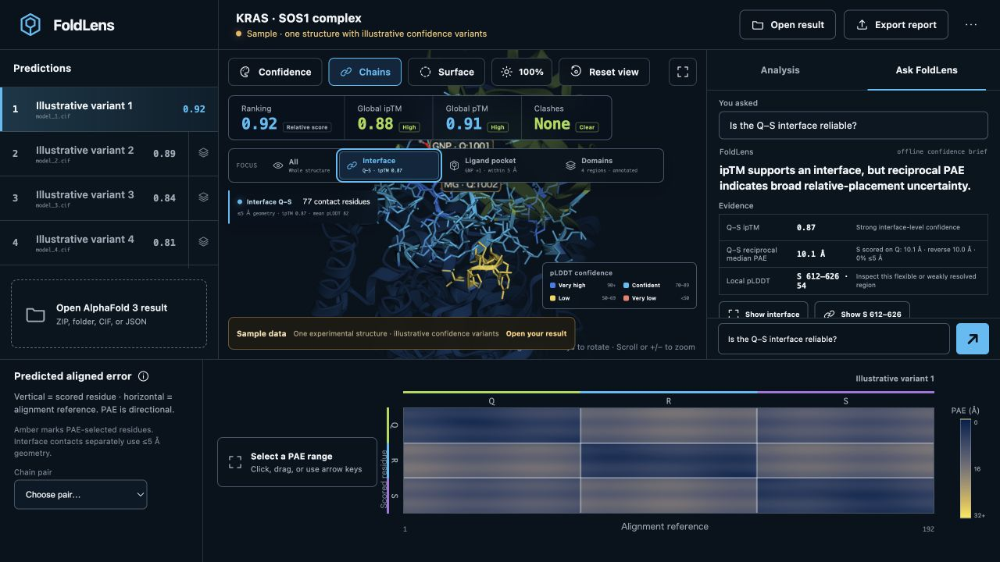

- 強み: Interfaceを押すと接触残基、≤5 Å、ipTM、平均pLDDT、3Dの強調が同時に変わる。因果が明確でデモ映えする。
- リスク: focus readout、pLDDT legend、sample ribbonが分子上に重なり、表示面積を削る。
- 改善: focus中はscore stripをcompact化し、readoutを一つのinformation railへまとめる。

### 4. PAE linked selection — 非常に良好

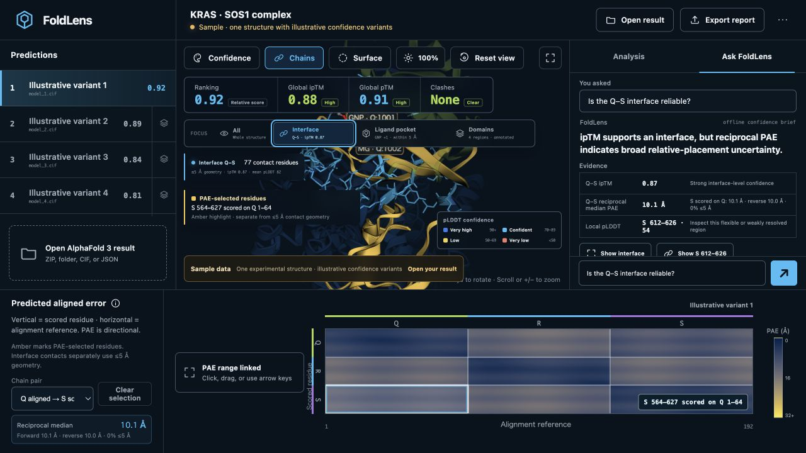

- 強み: `Q aligned → S scored`の方向性、reciprocal median、3Dのamber highlightが連動する。FoldLensの中核価値が最も明瞭に出る画面。
- リスク: `forward/reverse/0% ≤5 Å`が小さく、専門家でも読み取りに時間がかかる。
- 改善: reciprocal medianを主値、directional valuesを2行目にし、`Why reciprocal?`の短い説明を置く。

### 5. AI evidence action — 強いが状態不一致あり

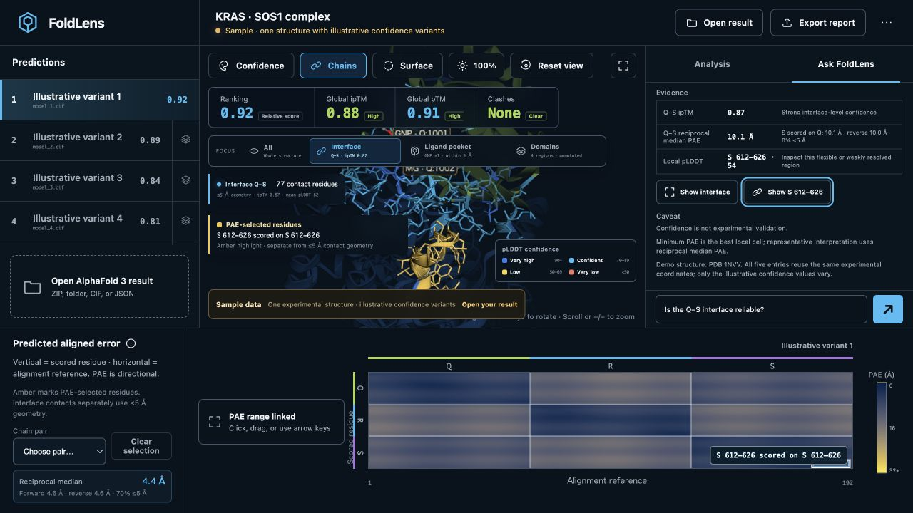

- 強み: 回答内のresidue rangeから3DとPAEへ直接戻れる。通常のチャットUIとの差別化として非常に強い。
- リスク: `Show S 612–626`後、PAE selectionは`S 612–626 scored on S 612–626`だがpair pickerは`Choose pair…`。入力と結果が矛盾して見える。
- 改善: chain pair、custom range、AI evidence selectionを同一のselection modelとして画面上でも明示する。

### 6. Deterministic analysis — 良好

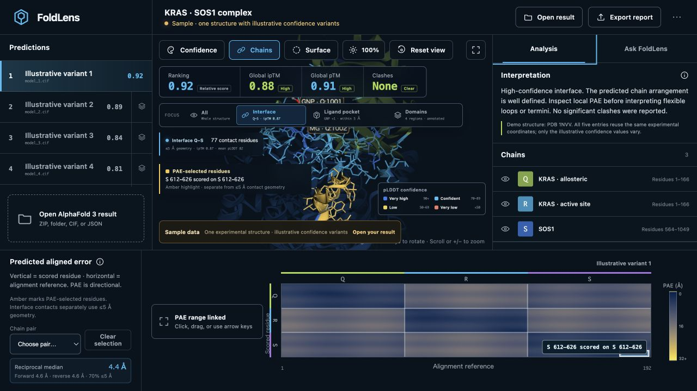

- 強み: AIがなくてもchain、ligand、PAE matrixが確認でき、trust boundaryがある。
- リスク: `Analysis`と`Ask FoldLens`の役割差が名称だけでは弱い。
- 改善: `Measured facts`と`GPT explanation`のように、事実と生成解釈の境界が瞬時に分かる名前へ変える。

### 7. モバイル入口 — 良好

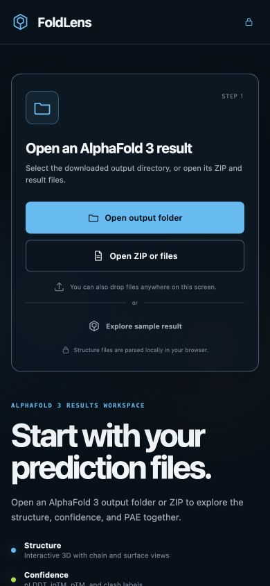

- 強み: import cardを先に出す判断は正しい。主要CTAは44px以上で、サンプルもfirst viewport内にある。
- リスク: headerのlock iconは説明文が消えて単独になり、意味が伝わりにくい。sample CTAは視認性が低い。
- 改善: lock iconをカード内の`Parsed locally` badgeへ統合する。

### 8. モバイルStructure — 良好

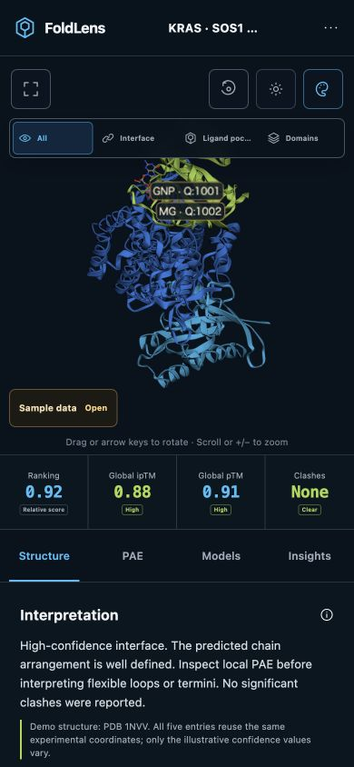

- 強み: 3D、focus、scores、tabsの順序が素直。Structureタブの読み始めもfirst viewport内に入る。
- リスク: headerのjob名と`Ligand pocket`が省略され、tooltipのないタッチ環境では全文を知る方法がない。
- 改善: job名は2行まで許容するかdetails sheetで全文を出す。focusは短縮名`Pocket`でよい。

### 9. モバイルPAE初期 — 要改善

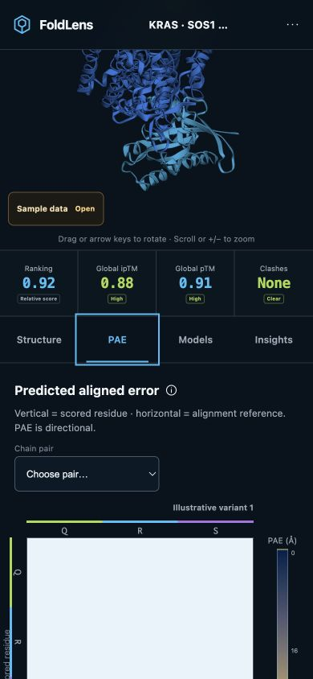

- 強み: タブとheading、pair pickerは明確。
- リスク: 3D viewerが上に残るため、heatmap本体がfirst viewportにほぼ入らない。
- 改善: PAEタブでは3Dをsticky thumbnailへ縮小し、PAEと3Dのselection linkageだけを維持する。

### 10. モバイルPAE選択 — 良好

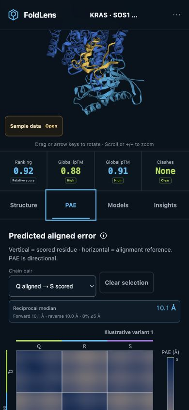

- 強み: pair、clear、median、directional valuesが一続きで、desktopより理解しやすい。
- リスク: heatmapの下半分とselection labelはスクロール後でないと見えない。
- 改善: pair selection後にheatmapの選択領域へ滑らかにスクロールし、上部には小さな3D linkage badgeだけを残す。

### 11. モバイルModel comparison — 重大なフィードバック欠落

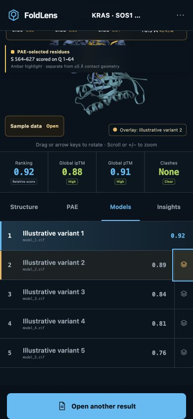

- 強み: 比較対象はamberで明確に選択される。
- リスク: 操作時のscrollYが195pxのまま、comparison summaryがviewer上部へ追加される。その位置はviewportの上側に隠れ、ユーザーは差分値を見られない。画像でも選択状態以外の比較結果が見えない。
- 改善: summaryをModelsタブ内で選択行の直上に配置する。3D overlayはsecondary feedbackにする。

### 12. モバイルInsights — 強いが冗長

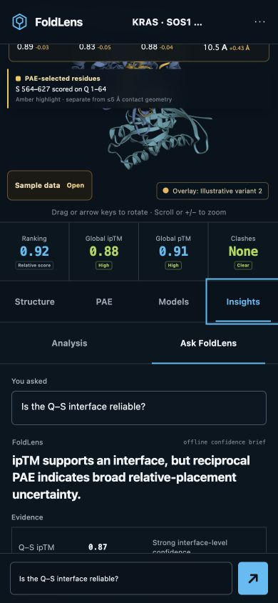

- 強み: 結論が17pxで読みやすく、sticky composerも使いやすい。
- リスク: 同じ質問が`You asked`とcomposerに重複する。比較overlayが残り、Insightsの目的と無関係な状態も上に積まれる。`offline confidence brief`は小さく、AIの出所が伝わりにくい。
- 改善: composerはplaceholderへ戻す。answer sourceを`GPT-5.6`または`Local metric baseline`のbadgeで明確に分ける。

### 13. 900px中間幅 — 重大

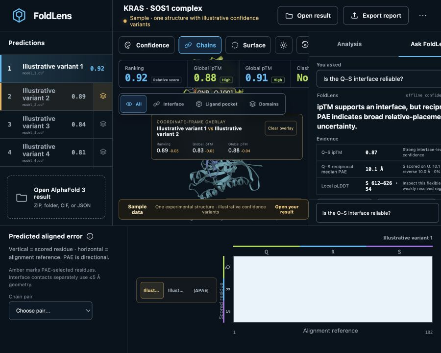

- 実測: prediction rail 230px、viewer 400px、inspector 330pxで合計960px。viewportは900pxで、inspector右端が60px切れた。
- 影響: `Ask FoldLens`、回答文、evidence、送信操作が欠ける。toolbarとscore stripも圧縮・切断される。横スクロールも提供されない。
- 改善: 960px未満をmobile layoutにするのが最短。より良い案は、960–1180pxを`viewer + inspector`の2列にし、Models/PAEをtabsへ移すこと。

## アクセシビリティ

### 確認できた強み

- menuはEscapeで閉じ、focusが`More options`へ戻った。
- mobile result tabsはArrowLeft/ArrowRightで選択とfocusが移動した。
- PAE canvasはkeyboard focusを持ち、Escapeでselectionを解除できた。
- 3D viewerにもarrow keys、+/−、Homeの説明と操作がある。
- dialogはfocus trap、Escape、focus restoreを実装している。
- `aria-live`、`aria-busy`、reduced-motion対応がある。
- 主要色tokenのコントラストは背景`#07131d`に対して、muted 7.97:1、faint 4.78:1、cyan 8.78:1、lime 11.35:1だった。

### リスク

- 7–10pxの文字が多数あり、コントラストが通っても実用上読みづらい。特にPAE補助値、model source、comparison delta、免責文。
- 390px幅で確認できた小さい操作領域: `More options`約37×44px、sample約119×42px、`Clear overlay`約66×30px、Ask button約42×46px。
- 900pxでは`Reset view`のlabelがCSSで非表示になり、button自体に`aria-label`がないため無名controlになった。
- desktop/mobile双方のUIを同時mountしCSSで片方を隠している。DOM上に`id="undefined"`の3D canvasが2つ存在し、非表示側のviewer/heatmapも生成される。支援技術の頑健性と描画負荷の両面で整理余地がある。

スクリーンショットとDOM確認だけでは、VoiceOver/NVDAの読み上げ品質、200% zoom、色覚シミュレーション、実機のpointer accuracy、Safari/FirefoxのWebGL挙動までは確認していない。WCAG適合を示す監査ではない。

## 優勝に向けた実装順

1. 960px未満の切断を修正する。
2. sampleのAI初期状態を`baseline → Run GPT-5.6 → evidence actions`へ再設計する。
3. mobile comparison summaryをModelsタブ内へ移す。
4. 非Structureタブで3D viewerを縮める。
5. custom PAE selectionとpair pickerの状態を一致させる。
6. 7–10px文字を整理し、無名buttonと44px未満の主要targetを直す。
7. 90秒のguided demoを加え、最後にexport reportを見せる。

